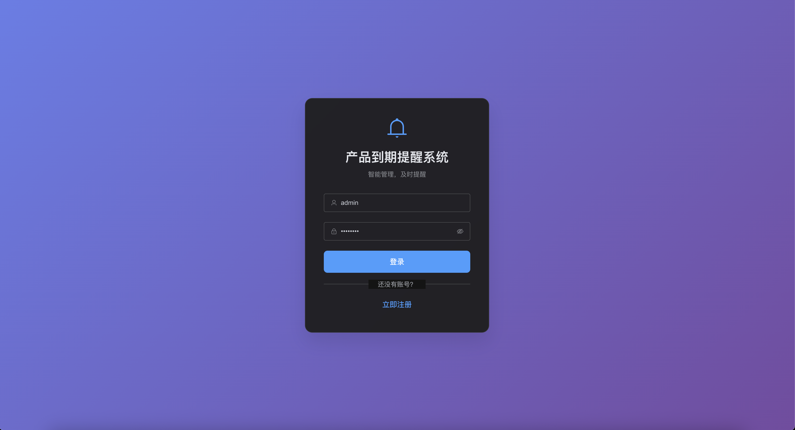
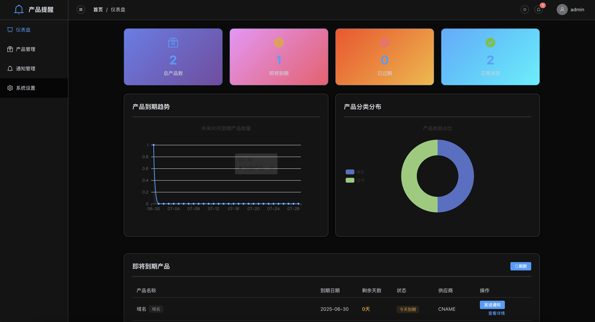
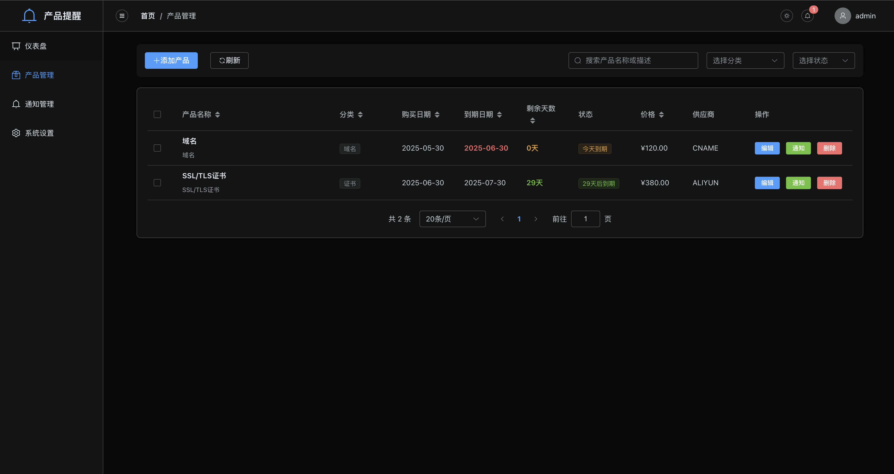
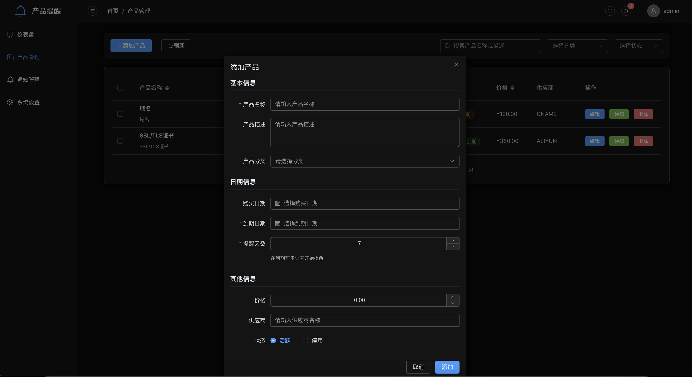
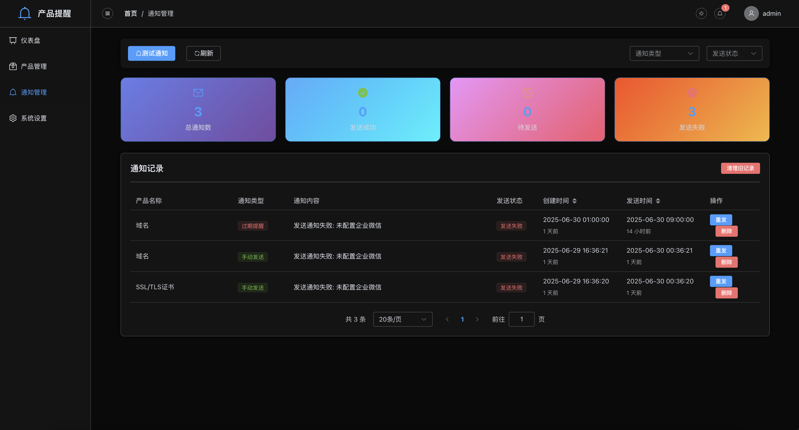
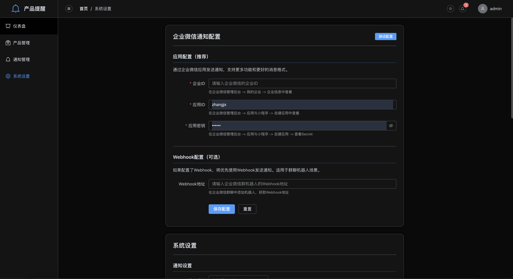

# 产品到期自动提醒系统

一个基于 Web 的产品到期管理系统，支持自动提醒和企业微信通知功能。

## 🌟 功能特色

- 📦 **产品管理** - 添加、编辑、删除产品信息，支持分类管理
- ⏰ **智能提醒** - 可配置的到期提醒天数，自动计算提醒时间
- 📱 **企业微信通知** - 支持企业微信 API 和 Webhook 两种通知方式
- 📊 **数据统计** - 直观的图表展示产品状态和到期趋势
- 🔐 **用户认证** - 安全的登录注册系统，支持多用户
- 🏃 **自动化任务** - 后台定时任务自动检查并发送提醒

## 📸 系统截图

### 登录界面


*安全的用户认证系统，支持用户注册和登录*

### 仪表板


*系统首页，展示产品统计信息和到期趋势图表*

### 产品管理


*产品列表页面，支持添加、编辑、删除和搜索功能*

### 添加产品


*演示如何添加新产品的完整流程*

### 通知历史


*查看所有通知发送历史和状态*

### 系统设置


*配置企业微信通知参数*

## 🎬 功能演示

### 完整工作流程


*从添加产品到接收提醒的完整工作流程演示*

### 企业微信通知效果


*企业微信中收到的产品到期提醒消息*

## 🚀 快速开始

### 环境要求

- Node.js 16.x 或更高版本
- npm 或 yarn 包管理器

### 安装步骤

1. **克隆项目**
   ```bash
   git clone https://github.com/junxinzhange/product-reminder.git
   cd product-reminder
   ```

2. **安装依赖**
   ```bash
   npm run install-all
   ```

3. **启动开发服务器**
   ```bash
   npm run dev
   ```

4. **访问应用**
   ```
   前端: http://localhost:8080
   后端: http://localhost:3000
   ```

### Docker 部署

1. **使用 Docker Compose**
   ```bash
   docker-compose up -d
   ```

2. **访问应用**
   ```
   http://localhost (通过 Nginx 代理)
   ```

## ⚙️ 配置说明

### 环境变量

创建 `.env` 文件配置以下参数：

```env
# 服务器配置
PORT=3000
NODE_ENV=production
JWT_SECRET=your-super-secret-jwt-key

# 数据库配置
DATABASE_PATH=./server/database.sqlite

# 企业微信配置
WECHAT_CORP_ID=你的企业ID
WECHAT_AGENT_ID=应用的AgentId
WECHAT_SECRET=应用的Secret
WECHAT_WEBHOOK_URL=企业微信群机器人Webhook地址
```

### 企业微信配置

1. **获取企业微信参数**
   - 登录企业微信管理后台
   - 创建自建应用获取 `AgentId` 和 `Secret`
   - 记录企业 `CorpId`

2. **配置通知方式**
   - **API 方式**: 配置 `WECHAT_CORP_ID`、`WECHAT_AGENT_ID`、`WECHAT_SECRET`
   - **Webhook 方式**: 配置 `WECHAT_WEBHOOK_URL`

## 📋 使用指南

### 1. 用户注册和登录
- 首次使用需要注册账号
- 使用用户名和密码登录系统

### 2. 添加产品
- 点击"添加产品"按钮
- 填写产品信息：名称、描述、分类、采购日期、到期日期等
- 设置提醒天数（默认 7 天）

### 3. 管理产品
- 在产品列表中查看所有产品
- 使用搜索和筛选功能快速找到产品
- 编辑或删除不需要的产品

### 4. 查看通知
- 在通知历史页面查看所有提醒记录
- 了解通知发送状态和时间

### 5. 配置系统
- 在设置页面配置企业微信通知参数
- 测试通知功能是否正常工作

## 🔧 技术架构

### 后端技术栈
- **Node.js + Express** - 服务器框架
- **SQLite** - 轻量级数据库
- **node-cron** - 定时任务调度
- **JWT** - 用户认证
- **企业微信 API** - 消息通知

### 前端技术栈
- **Vue 3** - 前端框架
- **Element Plus** - UI 组件库
- **Pinia** - 状态管理
- **Vue Router** - 路由管理
- **ECharts** - 图表组件

### 数据库设计
```sql
-- 用户表
users (id, username, password, email, created_at, updated_at)

-- 产品表
products (id, name, description, category, purchase_date, expiry_date, 
         price, supplier, status, reminder_days, user_id, created_at, updated_at)

-- 通知表
notifications (id, product_id, message, type, status, sent_at, created_at)

-- 企业微信配置表
wechat_config (id, corp_id, agent_id, secret, webhook_url, is_active, 
              created_at, updated_at)
```

## 📈 功能详解

### 自动提醒机制
- **检查频率**: 每天上午 9:00 自动检查
- **提醒逻辑**: 根据产品设置的提醒天数计算是否需要发送提醒
- **防重复**: 同一产品每天最多发送一次提醒
- **状态跟踪**: 记录所有通知的发送状态和时间

### 通知类型
- **即将到期**: 产品在设定天数内即将到期
- **已经到期**: 产品已经超过到期日期
- **手动测试**: 用户手动触发的测试通知

## 🛠️ 开发说明

### 项目结构
```
product-reminder/
├── client/                 # Vue.js 前端
│   ├── src/
│   │   ├── views/         # 页面组件
│   │   ├── stores/        # Pinia 状态管理
│   │   ├── router/        # 路由配置
│   │   └── utils/         # 工具函数
│   └── package.json
├── server/                 # Node.js 后端
│   ├── routes/            # API 路由
│   ├── services/          # 业务逻辑
│   ├── database/          # 数据库相关
│   └── index.js
├── docker-compose.yml      # Docker 配置
└── package.json
```

### 开发命令
```bash
# 安装所有依赖
npm run install-all

# 开发模式（同时启动前后端）
npm run dev

# 单独启动后端
npm run server

# 单独启动前端
cd client && npm run serve

# 构建生产版本
npm run build

# 启动生产服务器
npm start
```

### API 接口

#### 认证相关
- `POST /api/auth/register` - 用户注册
- `POST /api/auth/login` - 用户登录
- `GET /api/auth/profile` - 获取用户信息

#### 产品管理
- `GET /api/products` - 获取产品列表
- `POST /api/products` - 添加产品
- `PUT /api/products/:id` - 更新产品
- `DELETE /api/products/:id` - 删除产品

#### 通知管理
- `GET /api/notifications` - 获取通知历史
- `POST /api/notifications/test` - 发送测试通知

## 🤝 贡献指南

1. Fork 项目
2. 创建特性分支 (`git checkout -b feature/AmazingFeature`)
3. 提交更改 (`git commit -m 'Add some AmazingFeature'`)
4. 推送到分支 (`git push origin feature/AmazingFeature`)
5. 开启 Pull Request

## 📄 许可证

本项目采用 MIT 许可证 - 查看 [LICENSE](LICENSE) 文件了解详情

## 💬 支持与反馈

如果您在使用过程中遇到问题或有改进建议，请：

1. 查看 [Issues](https://github.com/junxinzhang/product-reminder/issues) 页面
2. 创建新的 Issue 描述问题
3. 或发送邮件至 jason2023zhang@gmail.com

---

⭐ 如果这个项目对您有帮助，请给个 Star 支持一下！